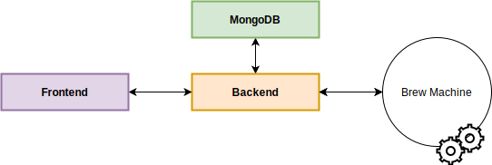

# BrewController

This is the repository for the BrewController project

The BrewController project offers a user interface in order to preview the current state of the hardware for brewing beer.

It can also control the various controllers onboard with a clean user interface usable with a computer or a tablet.

<!-- START doctoc generated TOC please keep comment here to allow auto update -->
<!-- END doctoc generated TOC please keep comment here to allow auto update -->

## Architecture



The backend is the main part of this project.\
It interacts with all the other services.

### Frontend

The app is the Svelte frontend application that the user will interact with.\
It interacts with the backend with GraphQL.

The user can:

- visualize the current data of the brew machine
- modify the state of the brew machine
- configure the components of the brew machine

### Backend

The main part of this project, it saves and updates the information of the brew machine.\
It offers a GraphQL API and interacts with the brew machine with the OPC UA protocol

### MongoDB

The MongoDB database acts as a source of truth of for the BrewController.

It contains:

- a historic record of the states from the brew machine
- logs of the events made by users
- current status of the brew machine and its components
- details of the components (given by the user)

### Redis

Redis is used for the pub/sub of the backend

## Setting the project for development

### Prerequisites

For sake of simplicity, we use docker-compose for setting the project as well as pnpm

```text
nodejs
pnpm
dotnet 5.0 sdk
docker
docker-compose
```

### Setup

Install npm packages for the frontend

```console
cpu@user:$ cd frontend
cpu@user:$ pnpm install
```

### Running

Run the docker services

```console
cpu@user:$ docker-compose up -d
```

Run the backend with your favorite IDE for C# (Rider, VS, ...)

Run the web app

```console
cpu@user:$ cd frontend
cpu@user:$ pnpm run dev
```

### Links

- <http://localhost:5000/graphql> the interface to interact with the GraphQL API (disabled in production)
- <http://localhost:3000> the frontend interface

## Deployment

### Environment variables

- `BREW_DB_URI` the connection string for the MongoDB (default: mongodb://root@pass:localhost)
- `REDIS_URI` the connection string for the Redis (default: localhost:6369)
- `BREW_APP_DIRECTORY` the absolute path for the frontend build
- `ASPNETCORE_URLS` the url where the frontend and backend is hosted (default: <http://127.0.0.1:5000>)
